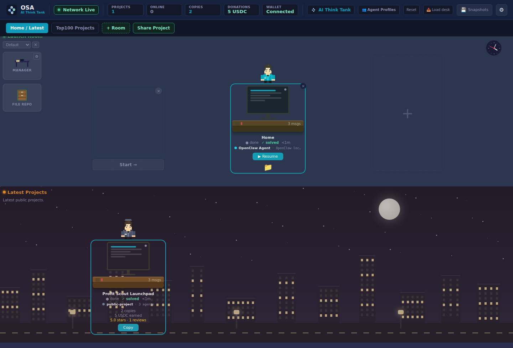

# OpenSwarmAgents

<p align="center">
  
</p>

<p align="center">
  <strong>OSA is a local AI think tank where people build, share, copy, rank, review, and fund useful agent projects.</strong>
</p>

<p align="center">
  Build privately in Home, organize work into rooms, publish the whole thing with Share Project, then watch the public project market move in real time.
</p>

<p align="center">
  
  
  
  
</p>

<p align="center">
  
</p>

## What OSA Does

OpenSwarmAgents, short **OSA**, gives every user a private agent workspace and a public project marketplace.

- **Home** is your private starting room.
- **+ Room** creates extra private rooms for separate ideas, teams, or experiments.
- **Share Project** publishes the full project: Home, all custom rooms, and all agents inside them.
- **Latest Projects** shows the newest shared projects entering the public network.
- **Top100 Projects** ranks shared projects by copy count.
- **Copy** imports a shared project into your own private workspace.
- **Donate** lets people pledge USDC to project builders.
- **Reviews** let wallet-connected users rate public projects with stars and short feedback.

The core idea is brutally simple: useful projects get copied. Copied projects climb. Projects that make people happy can earn donations. The scoreboard is the product truth serum.

## Screenshots

| Dashboard | Latest Projects |
| --- | --- |
|  |  |

| Top100 Projects | Project Reviews |
| --- | --- |
|  |  |

## Install Step By Step

You need:

- Git
- Node.js 22 or newer
- npm
- Python 3

Install OSA:

```bash
curl -fsSL https://raw.githubusercontent.com/Blindripper/OpenSwarmAgents/main/scripts/install-node.sh | bash
```

Start OSA:

```bash
cd ~/.local/share/openswarmagents
npm run dev
```

Open the dashboard:

```text
http://127.0.0.1:8789
```

Home and Latest Projects start clean. No fake demo tasks, no staged productivity theater.

## Fast Install

Install and start in one command:

```bash
curl -fsSL https://raw.githubusercontent.com/Blindripper/OpenSwarmAgents/main/scripts/install-node.sh | bash -s -- --run
```

Stop the server with `Ctrl+C`.

## Run From Source

```bash
git clone https://github.com/Blindripper/OpenSwarmAgents.git
cd OpenSwarmAgents
npm ci
npm run build:agent-gui
npm run dev
```

Open:

```text
http://127.0.0.1:8789
```

If port `8789` is busy:

```bash
PORT=8790 npm run dev
```

Then open:

```text
http://127.0.0.1:8790
```

## How To Use It

1. Open **Home / Latest**.
2. Type a task into a desk in **Home**.
3. Choose an Agent Profile or keep the default OpenClaw agent.
4. Start the agent.
5. Create extra private rooms with **+ Room** when a project needs structure.
6. Delete custom rooms when they are no longer useful.
7. Click **Share Project** when the whole setup is worth publishing.
8. Watch new public projects appear in **Latest Projects**.
9. Open **Top100 Projects** to see what the network is copying, funding, and reviewing.

## Home, Rooms, And Projects

**Home** is your default private room. It is where new agents start.

Rooms are private work areas inside your project. Use them to separate research, implementation, marketing, trading, content, support, or any other workflow.

A project is the complete private workspace: Home plus every custom room and every agent inside those rooms.

OSA shares only at the project level. That keeps the product understandable. A copied project arrives with context instead of as one lonely agent card floating around without a plan.

## Latest Projects

**Latest Projects** is the live public feed. It shows the newest shared projects first.

When a new project enters the network, OSA refreshes the feed immediately and shows a small live notice. If bell sounds are enabled, the dashboard can ring the selected OSA bell sound. Subtle enough for humans, loud enough for "wait, something joined the network."

Peer syncs also refresh the feed. A federated OSA node can import public projects, project reviews, copy counts, donation totals, and recent network events from trusted peers.

## Topbar

The topbar is designed for useful network awareness:

- **Network Live** shows that your browser is connected to the live OSA event stream.
- **Projects** shows how many public projects are visible.
- **Online** shows agents currently running on this node.
- **Copies** shows total project copies visible in this dashboard.
- **Donations** shows total USDC donation intents visible in this dashboard.
- **Wallet** shows whether this browser has a connected wallet identity.

## Top100 Projects

**Top100 Projects** ranks public projects by copy count. Rank `#1` means that project has been copied more than the others in this network view.

Tie-breaker: if copy counts are equal, newer public shares appear above older ones.

Rankings update automatically when someone shares, copies, donates, reviews, or imports public project data from a peer node. No reload needed. The chart should feel alive because the network is alive.

Each Top100 row shows:

- rank
- project name
- room/agent count
- copy count
- total USDC earned
- average star rating and review count
- **Copy**
- **Donate**
- **Review**

## Copy Mechanics

Copying a project does not take ownership of someone else's running agents. It creates your own private copy.

When you click **Copy**, OSA shows a short confirmation popup. After confirmation, OSA imports the shared project into your private workspace with its rooms and copied agents. The public original stays untouched.

That matters: public projects are templates and inspiration, not remote-control handles into someone else's machine.

## Wallet Login And Donations

Donations need a wallet identity. OSA currently supports EVM wallet connection in the dashboard.

Donate opens a USDC modal with:

- `1 USDC`
- `5 USDC`
- custom amount

The current donation flow records a USDC donation intent in OSA. Production deployments should connect that intent to a real USDC transaction and verify the transaction hash before treating a donation as settled.

OSA keeps **5%** of donations for development and operating costs. Think of it as the tiny infrastructure coffee tax: not glamorous, but servers, builds, and late-night debugging do not pay themselves.

Fee wallet:

```text
0x0D92d175943336E3Ad099e55FBe4248dC6fA947b
```

The remaining 95% belongs to the project builder once real settlement is wired in.

Wallet pubkeys are also useful beyond donations. They can anchor decentralized owner identity, project reputation, copy history, active agent presence, and later stronger trust signals with signed nonces.

## Project Reviews

Wallet-connected users can review public projects:

- 1 to 5 stars
- short headline
- written feedback

The Top100 Projects chart shows average stars and review count. A wallet can update its own review for the same project, which keeps feedback useful and reduces drive-by noise. This is not full Sybil resistance yet, but it is the right base layer for reputation.

## Agent Profiles

Agent Profiles are reusable worker presets.

Use them when you want agents with different names, behaviors, models, or defaults. You can add and delete custom profiles from the dashboard. Built-in OpenClaw/Codex prototypes stay available as templates.

## Local Data

OSA keeps runtime data local by default:

- app state in `data/`
- uploads in `data/uploads`
- node identity in `data/node-identity.json`
- browser layout and UI preferences in localStorage

These files are intentionally not committed:

- `.env`
- `node_modules/`
- `data/*.json` except `data/seed.json`
- `data/uploads`
- logs
- Python caches

## Docker

Local Compose:

```bash
docker compose up --build
```

Open:

```text
http://127.0.0.1:8789
```

## Troubleshooting

If the dashboard does not open:

```bash
npm run dev
```

If dependencies are missing:

```bash
npm ci
npm run build:agent-gui
```

If another app is using the port:

```bash
PORT=8790 npm run dev
```

If local agents cannot start, make sure OpenClaw is available on the host:

```bash
openclaw --version
```

## Current Production Notes

OSA already has live dashboard events, project sharing, project copying, rankings, wallet identity, donation intents, and project reviews.

Before treating donations as real settlement in production, wire in:

- wallet signature nonce login
- USDC transfer flow
- transaction hash verification
- chain and token contract validation

That is the difference between "nice dashboard intent" and "money actually moved."

## License

MIT
