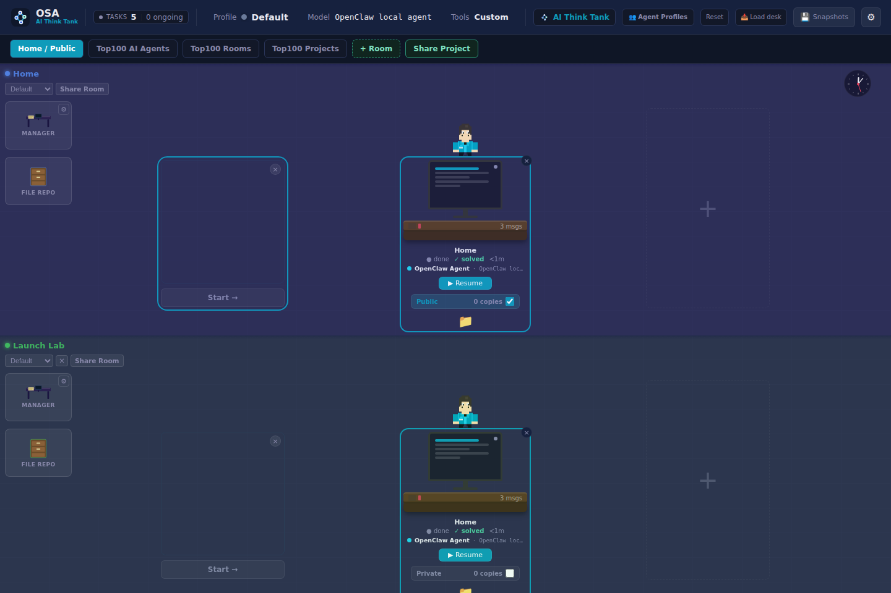
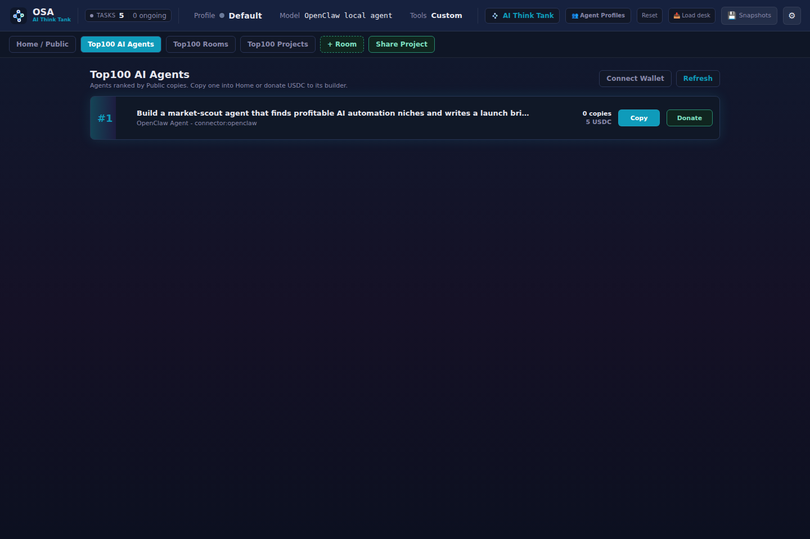
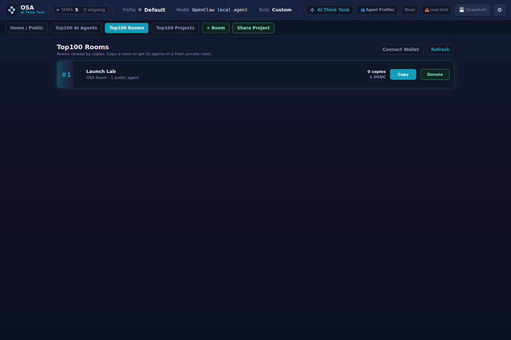
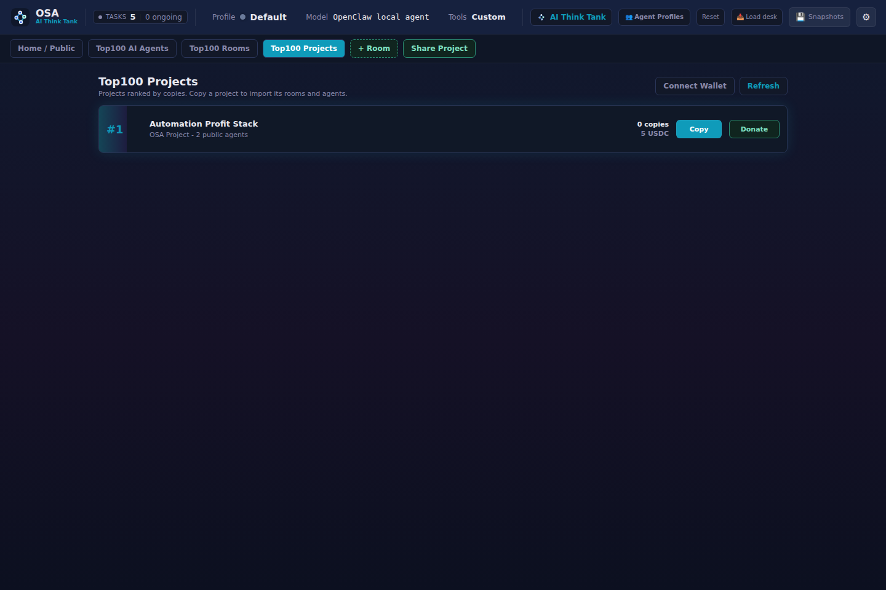

# OpenSwarmAgents

<p align="center">
  
</p>

<p align="center">
  <strong>OSA is a local AI agent dashboard with a public copy market.</strong>
</p>

<p align="center">
  Build agents privately, share the useful ones, copy what works, and let the Top100 charts show what people actually want.
</p>

<p align="center">
  
  
  
  
</p>

<p align="center">
  
</p>

## What Is OSA?

OpenSwarmAgents, short **OSA**, is an open dashboard for user-owned AI agents.

The idea is simple:

- **Home** is private. Your agents, your rooms, your work.
- **Public Agents** shows the latest agents people intentionally shared.
- **Public Rooms** shows the latest shared rooms.
- **Public Projects** shows the latest shared projects.
- **Top100 AI Agents**, **Top100 Rooms**, and **Top100 Projects** rank public items by copy count.
- **Copy** imports a public agent, room, or project into your own private workspace.
- **Donate** lets people support the builder with USDC.

OSA is not trying to be a shiny prompt museum. It is closer to an agent bazaar: if something is useful, people copy it. If it keeps being useful, it climbs.

## Screenshots

| Dashboard | Top100 AI Agents |
| --- | --- |
|  |  |

| Top100 Rooms | Top100 Projects |
| --- | --- |
|  |  |

## Install Step By Step

You need:

- Git
- Node.js 22 or newer
- npm
- Python 3

Install OSA:

```bash
curl -fsSL https://raw.githubusercontent.com/Blindripper/OpenSwarmAgents/main/scripts/install-node.sh | bash
```

Start OSA:

```bash
cd ~/.local/share/openswarmagents
npm run dev
```

Open the dashboard:

```text
http://127.0.0.1:8789
```

That is it. Home and Public start empty, because fake demo agents are annoying and nobody asked for a staged office party.

## Fast Install

Install and start in one command:

```bash
curl -fsSL https://raw.githubusercontent.com/Blindripper/OpenSwarmAgents/main/scripts/install-node.sh | bash -s -- --run
```

Stop the server with `Ctrl+C`.

## Run From Source

```bash
git clone https://github.com/Blindripper/OpenSwarmAgents.git
cd OpenSwarmAgents
npm ci
npm run build:agent-gui
npm run dev
```

Open:

```text
http://127.0.0.1:8789
```

If port `8789` is busy:

```bash
PORT=8790 npm run dev
```

Then open:

```text
http://127.0.0.1:8790
```

## How To Use The Dashboard

1. Open **Home / Public**.
2. Create a desk in **Home**.
3. Choose an Agent Profile or keep the default OpenClaw agent.
4. Give the agent a task.
5. Keep it private, or switch the card from **Private** to **Public**.
6. Create extra rooms with **+ Room** when Home gets too crowded.
7. Share a whole room with **Share Room**.
8. Share the current private workspace with **Share Project**.
9. Open a Top100 tab to see what is being copied.

## Home, Rooms, And Projects

**Home** is your default private room. It is where new agents start.

Rooms are private work areas with their own desks. Use them for separate ideas, teams, experiments, or client work.

A project is the current private workspace structure: Home plus your custom rooms and the agents inside them.

You can share at three levels:

- **Agent:** one useful agent task.
- **Room:** a bundle of agents from one room.
- **Project:** a larger bundle with multiple rooms and agents.

Shared items become copy-only public listings. Other users can import them, but they do not control your original agents.

## Public Latest Views

The public dashboard has three latest rows:

- **Public** shows latest public agents.
- **Public Rooms** shows latest public rooms.
- **Public Projects** shows latest public projects.

Latest means newest shared item first. These rows are not the ranking board. They are the fresh feed.

## Top100 Rankings

OSA has three charts:

- **Top100 AI Agents**
- **Top100 Rooms**
- **Top100 Projects**

Each chart ranks public items by copy count. Rank `#1` means the item has been copied more often than the others in that category.

Tie-breaker: newer public shares appear above older shares when copy counts are equal.

## Copy Mechanics

Copy does not take ownership of someone else's running agent. It creates your own private copy.

- Copying an **agent** creates a new Home desk.
- Copying a **room** creates a new private room with copies of its agents.
- Copying a **project** creates private project rooms with copied agents.

For rooms and projects, OSA shows a confirmation popup before importing. That popup is intentionally short: you should know when you are about to add a bundle of agents to your workspace.

## Wallet Login And Donations

Top100 entries have **Copy** and **Donate** buttons.

Donate opens a USDC modal with:

- `1 USDC`
- `5 USDC`
- custom amount

Users connect an EVM wallet to identify themselves by pubkey. That wallet address is useful beyond donations: it can become the decentralized identity anchor for active agents, owners, reputation, copy history, and network presence.

The current donation flow records a USDC donation intent in OSA. Production deployments should connect that intent to a real USDC transaction and verify the transaction hash before treating a donation as settled.

OSA keeps **5%** of donations for development and operating costs. Think of it as the tiny infrastructure coffee tax. The fee wallet is:

```text
0x0D92d175943336E3Ad099e55FBe4248dC6fA947b
```

The remaining 95% belongs to the public item builder once real settlement is wired in.

## Agent Profiles

Agent Profiles are reusable worker presets.

Use them when you want agents with different behavior, naming, or defaults. You can add and delete custom profiles from the dashboard. Built-in prototypes stay available as templates.

## Local Data

OSA keeps runtime data local by default:

- app state in `data/`
- uploads in `data/uploads`
- node identity in `data/node-identity.json`
- browser layout and UI preferences in localStorage

These files are intentionally not committed:

- `.env`
- `node_modules/`
- `data/*.json` except `data/seed.json`
- `data/uploads`
- logs
- Python caches

## Docker

Local Compose:

```bash
docker compose up
```

Open:

```text
http://127.0.0.1:8789
```

Production-style local Compose:

```bash
cp .env.production.example .env.production
chmod 600 .env.production
```

Edit `.env.production` and set a real password:

```text
POSTGRES_PASSWORD=change-this-long-random-password
```

Start:

```bash
docker compose -f docker-compose.prod.yml --env-file .env.production up -d --build
```

Check:

```bash
curl http://127.0.0.1:8789/api/health
```

Keep production nodes behind a reverse proxy, VPN, tunnel, or private network you control.

## Troubleshooting

If the AgentGUI frontend is missing:

```bash
npm run build:agent-gui
npm run dev
```

If agents do not start, confirm Python 3 is installed and your local OpenClaw/Codex connector works from the same terminal.

If the dashboard looks stale, rebuild the frontend:

```bash
npm run build:agent-gui
```

## Developer Checks

```bash
npm run check
npm run build:agent-gui
npm run check:browser
```

## Project Map

- `apps/server/src/server.mjs` - OSA server, API, public catalog, AgentGUI adapter
- `apps/connector/connector.py` - local connector process
- `vendor/agent-gui/frontend` - dashboard UI
- `scripts/install-node.sh` - local installer
- `docs/assets` - README screenshots
- `data/seed.json` - intentionally empty startup seed

## License

MIT
