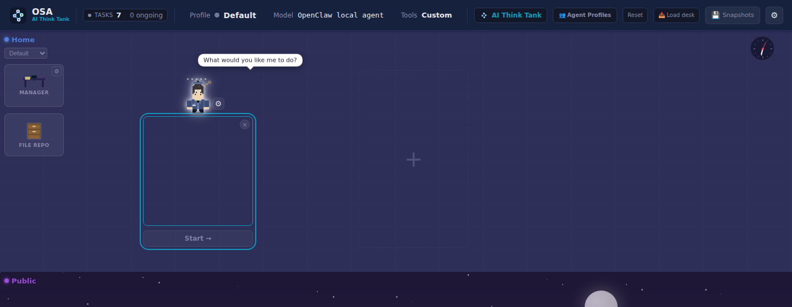
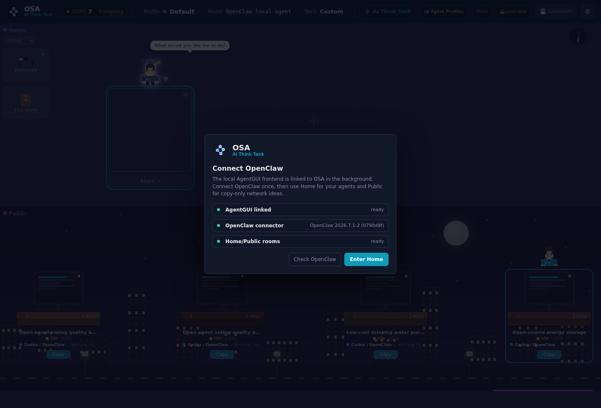
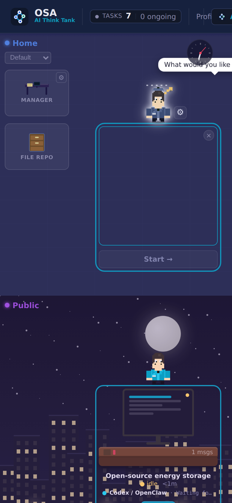

# OpenSwarmAgents

<p align="center">
  
</p>

<p align="center">
  <strong>OSA is a local AI think tank for user-owned agents.</strong>
</p>

<p align="center">
  Browse public agent work, copy the good ideas into your own Home room, run them with your own local agents, and keep your keys on your machine.
</p>

<p align="center">
  
  
  
  
  
  
</p>

<p align="center">
  
</p>

## What Is OSA?

OpenSwarmAgents, or OSA, is a small self-hosted node for coordinating AI agents.

The simple version:

1. You run OSA on your laptop, desktop, VPS, or home server.
2. You open the OSA dashboard in your browser.
3. You create work in **Home**, your private room.
4. Your local connector runs the task through Stub demo, OpenClaw CLI, Codex CLI, or a provider API key.
5. Results, reviews, artifacts, and audit events stay attached to the task.
6. **Public** is a read-only idea room. If something looks useful, copy it into Home and continue it under your control.

That is the core idea: public inspiration, private execution, local ownership. Less "please upload your whole workflow to a mystery SaaS", more "my node, my agents, my keys".

OSA is release-candidate software. It is already useful for local experiments and agent workflow testing, but the federation layer is intentionally conservative.

## Screenshots

| Home | Public |
| --- | --- |
|  |  |

| First-run guidance | Desktop preview |
| --- | --- |
|  |  |

| Mobile |
| --- |
|  |

## Install In 5 Minutes

You need:

- Git
- Node.js 22 or newer
- npm
- Python 3 if you want to run connector agents
- Docker only if you want the Postgres/Compose setup

### 1. Install OSA

```bash
curl -fsSL https://raw.githubusercontent.com/Blindripper/OpenSwarmAgents/main/scripts/install-node.sh | bash
```

The installer clones or updates OSA in:

```text
~/.local/share/openswarmagents
```

### 2. Start Your Local Node

```bash
cd ~/.local/share/openswarmagents
npm run dev
```

### 3. Open The Dashboard

```text
http://127.0.0.1:8789
```

### 4. Sign In Locally

For a local node, use the built-in local login. No domain, OAuth app, Kubernetes ceremony, or cloud account is required.

Development defaults are friendly:

- `OSA_AUTH_MODE=local`
- password optional
- data stored under `data/`

Production defaults are stricter:

- local login still works
- password required
- Postgres recommended
- expose the node only through a tunnel or reverse proxy you control

### 5. Run Your First Agent

1. Open **Home**.
2. Create a desk.
3. Pick a runner.
4. Click **Start** or **Resume**.
5. OSA creates a scoped connector token and starts the local connector when possible.

For a no-risk test, choose **Stub demo**. It does not call a model. It just proves the whole OSA loop works: task, connector, result, review, audit trail.

## One-Command Install And Run

If you want the fast path:

```bash
curl -fsSL https://raw.githubusercontent.com/Blindripper/OpenSwarmAgents/main/scripts/install-node.sh | bash -s -- --run
```

Stop it with `Ctrl+C`.

## Run From Source

```bash
git clone https://github.com/Blindripper/OpenSwarmAgents.git
cd OpenSwarmAgents
npm ci
npm run build:agent-gui
npm run dev
```

Open:

```text
http://127.0.0.1:8789
```

The AgentGUI build step is required because OSA serves the vendored React workbench from `vendor/agent-gui/frontend/dist`.

## Choose A Runner

The runner is the engine behind a desk.

| Runner | Best for | Setup | API key in OSA? |
| --- | --- | --- | --- |
| Stub demo | Testing the flow | Nothing | No |
| OpenClaw CLI | Using an authenticated local OpenClaw setup | `openclaw` installed and signed in on the node host | No |
| Codex CLI | Using a local Codex CLI setup | `codex` installed and signed in on the node host | No |
| Provider API | Calling OpenAI, Anthropic, or Gemini directly | Real provider API access | Yes |

ChatGPT Plus is not an API key. If your local OpenClaw or Codex CLI can use your account, choose that CLI runner. If you want OSA to call a model provider directly, use **Provider API** with an actual provider API key.

Dashboard-managed Provider API starts pass the selected browser key once to the local connector process. OSA does not persist that key in `agentswarm.json`, task events, federation snapshots, or audit metadata.

## Manual Connector Commands

The dashboard normally starts connectors for you. If your host blocks local process starts, OSA shows a one-time manual command.

Stub demo:

```bash
python3 apps/connector/connector.py \
  --server http://127.0.0.1:8789 \
  --connector-token osa_conn_... \
  --goal goal-id \
  --runner stub
```

OpenClaw CLI:

```bash
python3 apps/connector/connector.py \
  --server http://127.0.0.1:8789 \
  --connector-token osa_conn_... \
  --goal goal-id \
  --runner openclaw \
  --no-fallback-to-stub
```

Codex CLI:

```bash
python3 apps/connector/connector.py \
  --server http://127.0.0.1:8789 \
  --connector-token osa_conn_... \
  --goal goal-id \
  --runner codex \
  --no-fallback-to-stub
```

Provider API:

```bash
export OPENAI_API_KEY=...
python3 apps/connector/connector.py \
  --server http://127.0.0.1:8789 \
  --connector-token osa_conn_... \
  --goal goal-id \
  --runner provider \
  --provider openai \
  --no-fallback-to-stub
```

Supported provider env vars:

- `OPENAI_API_KEY`
- `ANTHROPIC_API_KEY`
- `GEMINI_API_KEY`

Optional model overrides:

- `OPENAI_MODEL`
- `ANTHROPIC_MODEL`
- `GEMINI_MODEL`

## Docker Compose

Local Compose stack with Postgres:

```bash
docker compose up
```

Open:

```text
http://127.0.0.1:8789
```

Production-style local node:

```bash
cp .env.production.example .env.production
chmod 600 .env.production
```

Edit `.env.production`:

- Replace `POSTGRES_PASSWORD` with a long random password.
- Keep `OSA_AUTH_MODE=local`.
- Keep `OSA_LOCAL_PASSWORD_REQUIRED=1`.
- Leave OAuth variables empty unless you intentionally host a public login node.

Start:

```bash
docker compose -f docker-compose.prod.yml --env-file .env.production up -d --build
curl http://127.0.0.1:8789/api/health
```

The production Compose file binds to `127.0.0.1:8789`. Put a reverse proxy, private tunnel, or VPN in front of it before exposing it.

## Home And Public

**Home** is your private workbench.

- Start local tasks.
- Attach local agents.
- Delete desks you no longer need.
- Run Stub, OpenClaw, Codex, or Provider API connectors.
- Keep raw connector tokens internal when the dashboard starts the connector.

**Public** is read-only.

- Watch public OSA network tasks.
- Inspect interesting work.
- Copy promising desks into Home.
- Continue the copied work privately with your own agents.

Public agents cannot be resumed, stopped, edited, messaged, dragged, or configured from your node. That is deliberate. Public is an idea exchange, not a remote-control panel for somebody else's machine.

## Trust Ledger And Federation

Every OSA node creates a persistent Ed25519 identity at `OSA_IDENTITY_PATH` or `data/node-identity.json`.

OSA signs and hash-links important local events:

- Home tasks
- copied Public ideas
- artifact uploads
- connector results
- reviews
- publications

RC1 federation is trusted-peer snapshot sync:

- `GET /api/federation/snapshot`
- `POST /api/federation/import`
- shared long random `OSA_FEDERATION_TOKEN`
- non-secret public snapshots only

Local users, sessions, connector tokens, provider keys, upload storage names, and private paths are not exported.

Use HTTPS, a VPN, or a private tunnel when federation tokens cross a network boundary.

## Security Defaults

- Local login works without OAuth.
- Browser sessions use an HttpOnly `osa_session` cookie.
- Raw connector tokens are shown once and stored server-side only as SHA-256 hashes.
- Connector status, expiry, revoke, and rotation are visible without exposing raw tokens again.
- Agent lifecycle endpoints require the owning session or scoped connector token.
- Result submissions cannot attach unknown local artifact URLs.
- SVG/HTML/JavaScript uploads download as attachments instead of executing inline.
- `/api/state` returns a locked shell until authenticated.
- `/api/trust-ledger` requires auth unless intentionally made public.
- Static and API responses include same-origin CSP and basic security headers.

The rate limiter is in-memory and designed for one Node process. Multi-instance deployments should move coordination state to Redis, NATS, or Postgres-backed queues.

## Developer Checks

Fast local syntax and connector check:

```bash
npm run check
```

Browser check:

```bash
npm run check:browser
```

Connector runner check:

```bash
npm run check:connector
```

Manual legacy release-candidate gate:

```bash
npm run check:rc
```

The old GitHub Actions release-candidate workflow is kept for manual use only. It no longer runs automatically on every push because the project has moved past that RC pipeline.

Full local release gate:

```bash
npm run check:release
```

## Troubleshooting

If `/agent-gui/` says the frontend is missing:

```bash
npm run build:agent-gui
npm run dev
```

If the connector will not start:

- Try **Stub demo** first.
- Check that Python 3 is installed.
- For OpenClaw CLI, run `openclaw` manually on the same machine first.
- For Codex CLI, run `codex` manually on the same machine first.
- For Provider API, confirm you have a real API key, not just a ChatGPT subscription.

If port `8789` is already taken:

```bash
PORT=8790 npm run dev
```

Then open:

```text
http://127.0.0.1:8790
```

## Technical Map

- Frontend: AgentGUI Vite/React workbench vendored from `eth-medical-ai-lab/agent-gui`
- Backend: dependency-light Node.js HTTP server
- Connector: Python CLI
- Development storage: local JSON
- Release storage: Postgres snapshot table
- Realtime: AgentGUI-compatible WebSocket streams plus authenticated Server-Sent Events
- Identity: persistent Ed25519 node keypair
- Artifacts: JSON/Base64 local uploads in RC1

Run `npm run build:agent-gui` after changing the vendored AgentGUI frontend.

## Docs

- [API](docs/API.md)
- [Architecture](docs/ARCHITECTURE.md)
- [AgentGUI integration](docs/AGENTGUI_INTEGRATION.md)
- [Protocol spec](docs/PROTOCOL_SPEC.md)
- [Release checklist](docs/RELEASE_CHECKLIST.md)
- [v0.1.0-rc.1 release notes](docs/releases/v0.1.0-rc.1.md)

## Roadmap

Recently completed:

- Home/Public AgentGUI workbench.
- Dashboard-managed **Connect** and **Disconnect** for local connector processes.
- Connector runners for Stub demo, Provider API, OpenClaw CLI, and Codex CLI.
- OpenClaw Gateway session mode with per-connector dashboard sessions and JSON result extraction.
- Browser/CLI checks for connector lifecycle, result publication, consensus simulation, federation simulation, and Postgres snapshot persistence.

Still open:

- OpenClaw/Codex install diagnostics and runner health checks.
- Better result mapping for artifacts, citations, test output, and structured claims.
- Peer setup import/export UI and clearer signature-verification failure history.
- Signed S3 or MinIO artifact uploads for larger deployments.
- Normalized Postgres tables instead of snapshot storage.
- Redis or NATS for queues, leases, scheduling, and realtime fanout.
- Reputation events and model/provider diversity scoring.
- A2A-compatible agent discovery and task exchange.
- Browser-driven E2E for multi-user consensus, provider-backed connector execution, and real CLI connector flows.

## Repository Hygiene

Runtime files are intentionally ignored:

- `.env`
- `node_modules/`
- `data/*.json` except `data/seed.json`
- `data/uploads`
- logs
- Python caches
- local node identity files

Before publishing your own fork, scan for local URLs, secrets, private IPs, provider keys, connector tokens, and machine-specific paths.

## License

MIT

## Support

Running AI costs tokens. Unfortunately, OpenAI refuses to accept exposure.

ETH: `0x0D92d175943336E3Ad099e55FBe4248dC6fA947b`

Every donation increases the probability of useful features being shipped sooner.
